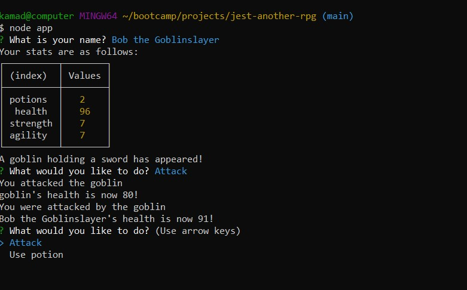

# jest-another-rpg

This RPG was created using Node.JS and was an exercise in learning JEST to facilitate Test Driven Design. Tests were designed for Player, Enemy, and Game objects and then code was written to make the tests pass. After establishing passing tests, the code was refactored so that all the objects could inherit their methods from a Character constructor. 

In order to run this app, you will need to install Node.JS on your system 

